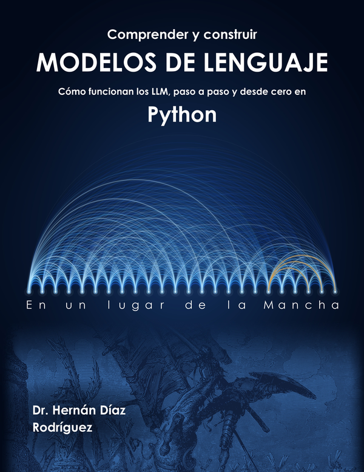

<!-- Encabezado en HTML: GitHub Pages no interpreta Markdown dentro de un <div>, y así se ve igual en los dos sitios. -->
<div align="center">
  <h1>Comprender y construir modelos de lenguaje 📘</h1>
  <h3><em>Cómo funcionan los LLM, paso a paso y desde cero en Python</em></h3>
  <p></p>
  <p>por <strong>Hernán Díaz Rodríguez, PhD</strong> — Profesor en la Universidad de Oviedo · Ex-investigador del CERN</p>
  <p>
    <a href="https://github.com/HernanDiaz/language-models"></a>
    <a href="https://creativecommons.org/licenses/by-nc/4.0/deed.es"></a>
    <a href="https://www.linkedin.com/in/hernandiazrodriguez"></a>
  </p>
</div>

---

## 📘 Sobre el libro

**Comprender y construir modelos de lenguaje** explica cómo funciona por dentro un modelo de lenguaje, como los que hay detrás de los asistentes conversacionales actuales, construyendo uno pequeño desde el principio. Empieza ajustando una recta a los precios de unas viviendas y termina entrenando, ajustando, evaluando y documentando un pequeño **GPT**: descenso de gradiente, bigramas, redes neuronales, **tokenización con BPE**, **atención y Transformer**, entrenamiento con método, generación de texto, ajuste para seguir instrucciones, evaluación y un proyecto final.

Todos los modelos son deliberadamente pequeños: **se entrenan en el procesador de un ordenador corriente en pocos minutos**, sin tarjeta gráfica ni descargas de modelos.

Este repositorio contiene los **11 cuadernos interactivos** del libro, uno por capítulo, listos para ejecutarse en Google Colab.

> 📗 Forma parte de la misma serie que [**Introducción a Deep Learning**](https://github.com/HernanDiaz/deep-learning).

---

## 📂 Estructura del repositorio

```
language-models/
├── 1_Como_aprende_un_modelo.ipynb    ← Un cuaderno por capítulo
├── 2_Modelado_de_lenguaje.ipynb
├── ...
├── 11_Proyecto_integrador.ipynb
├── cuaderno/N/                        ← Enlaces del libro a cada cuaderno en Colab
├── video/N/                           ← Enlaces del libro al vídeo de cada capítulo
└── material/                          ← Datos que usan los cuadernos
```

---

## 🎯 Qué vas a aprender

El libro y los cuadernos están organizados en **3 partes**:

| Parte | Tema | Capítulos |
|------|------|-----------|
| **1. Fundamentos** | Descenso de gradiente, modelos de lenguaje por recuentos, de la tabla a la red, redes con embeddings | 1–4 |
| **2. Construir un GPT** | Tokenización con BPE, atención y Transformer, entrenamiento con método, generación e inferencia | 5–8 |
| **3. Ajustar, evaluar y aplicar** | Del modelo base al asistente, evaluación y límites, proyecto integrador | 9–11 |

---

## 🚀 Cómo usar los cuadernos

- Haz clic en **Abrir en Colab** para ejecutar el código de cada capítulo, sin instalar nada.
- Sigue el libro mientras experimentas con los ejemplos: el cuaderno es el laboratorio y el libro, la explicación.
- Los cuadernos 1, 2, 3 y 5 usan solo Python estándar; los demás usan **PyTorch**, que Colab ya trae instalado. Ninguno necesita GPU.
- Los cuadernos 7, 9 y 11 entrenan modelos durante varios minutos.
- Si prefieres ejecutarlos en local, los cuadernos 5 a 10 descargan solos los datos de la carpeta `material/` si no los encuentran.

---

## 📚 Cuadernos y vídeos

| Cap. | Título | Colab | Vídeo |
|------|--------|-------|-------|
| 1 | Cómo aprende un modelo | [](https://colab.research.google.com/github/HernanDiaz/language-models/blob/main/1_Como_aprende_un_modelo.ipynb) | Próximamente |
| 2 | Modelado de lenguaje | [](https://colab.research.google.com/github/HernanDiaz/language-models/blob/main/2_Modelado_de_lenguaje.ipynb) | Próximamente |
| 3 | Del recuento a la red | [](https://colab.research.google.com/github/HernanDiaz/language-models/blob/main/3_Del_recuento_a_la_red.ipynb) | Próximamente |
| 4 | Redes para predecir texto | [](https://colab.research.google.com/github/HernanDiaz/language-models/blob/main/4_Redes_para_predecir_texto.ipynb) | Próximamente |
| 5 | Tokenización | [](https://colab.research.google.com/github/HernanDiaz/language-models/blob/main/5_Tokenizacion.ipynb) | Próximamente |
| 6 | Atención y Transformer | [](https://colab.research.google.com/github/HernanDiaz/language-models/blob/main/6_Atencion_y_Transformer.ipynb) | Próximamente |
| 7 | Entrenamiento y datos | [](https://colab.research.google.com/github/HernanDiaz/language-models/blob/main/7_Entrenamiento_y_datos.ipynb) | Próximamente |
| 8 | Generación e inferencia | [](https://colab.research.google.com/github/HernanDiaz/language-models/blob/main/8_Generacion_e_inferencia.ipynb) | Próximamente |
| 9 | Del modelo base al asistente | [](https://colab.research.google.com/github/HernanDiaz/language-models/blob/main/9_Del_modelo_base_al_asistente.ipynb) | Próximamente |
| 10 | Evaluación y límites | [](https://colab.research.google.com/github/HernanDiaz/language-models/blob/main/10_Evaluacion_y_limites.ipynb) | Próximamente |
| 11 | Proyecto integrador | [](https://colab.research.google.com/github/HernanDiaz/language-models/blob/main/11_Proyecto_integrador.ipynb) | Próximamente |

---

## 🗂️ Datos

| Archivo | Contenido | Cuadernos |
|---------|-----------|-----------|
| `material/quijote.txt` | Texto completo de *Don Quijote de la Mancha*, de dominio público | 6 a 10 |
| `material/gpt_quijote.pt` | El GPT de caracteres entrenado en el capítulo 7 | 8 a 10 |
| `material/corpus_capitulos_1_4.txt` | Texto de los capítulos 1 a 4 del libro, para entrenar el tokenizador | 5 y 10 |

---

## 👨‍🏫 Sobre el autor

**Hernán Díaz Rodríguez** es Profesor del Departamento de Ciencias de la Computación e Inteligencia Artificial de la **Universidad de Oviedo**, donde obtuvo su Doctorado en Informática. Ingeniero en Informática por la misma institución y **MBA por Open University (Reino Unido)**.

Cuenta con más de 20 años de experiencia en los sectores público y privado, desarrollando proyectos de tecnología e investigación avanzada. Destacan sus **5 años de trabajo en el CERN**, el Centro Europeo de Investigación Nuclear, uno de los mayores laboratorios científicos del mundo.

[💼 LinkedIn](https://www.linkedin.com/in/hernandiazrodriguez) · [📧 Correo](mailto:hernan.diaz.rodriguez@gmail.com) · [📕 Página de autor en Amazon](https://www.amazon.es/Hernan-Diaz-Rodriguez/e/B0GD8JQ9JB)

---

## ⭐ ¿Te ha resultado útil?

Si estos cuadernos te están ayudando a entender los modelos de lenguaje, puedes apoyar el proyecto:

- ⭐ **Dejando una estrella** en este repositorio — ayuda a que otros lo descubran.
- 💬 **Compartiéndolo** con un compañero, estudiante o profesor al que pueda interesarle.

¡Gracias! 🙏

---

## 🧾 Licencia

Este material se distribuye bajo [**Creative Commons Attribution-NonCommercial 4.0 International (CC BY-NC 4.0)**](https://creativecommons.org/licenses/by-nc/4.0/deed.es).

✅ **Permitido:** uso para docencia, estudio o apuntes personales; adaptaciones con fines educativos, **citando al autor**.
❌ **No permitido:** uso comercial o lucrativo; redistribución en productos comerciales sin permiso.

---

## 📖 Cómo citar

Si utilizas este material en un trabajo académico, por favor cita:

```bibtex
@book{diazrodriguez2026modelos,
  author    = {Hern{\'a}n D{\'\i}az Rodr{\'\i}guez},
  title     = {Comprender y construir modelos de lenguaje: C{\'o}mo funcionan los LLM, paso a paso y desde cero en Python},
  year      = {2026},
  publisher = {Publicaci{\'o}n independiente},
  url       = {https://github.com/HernanDiaz/language-models}
}
```

---

## 📬 Contacto

¿Has detectado un error o tienes una sugerencia? Me encantará leerte:
📧 **hernan.diaz.rodriguez@gmail.com**

Para adopción institucional del libro en cursos o programas docentes, indica tu institución y la asignatura en el correo — estaré encantado de apoyar a docentes.
