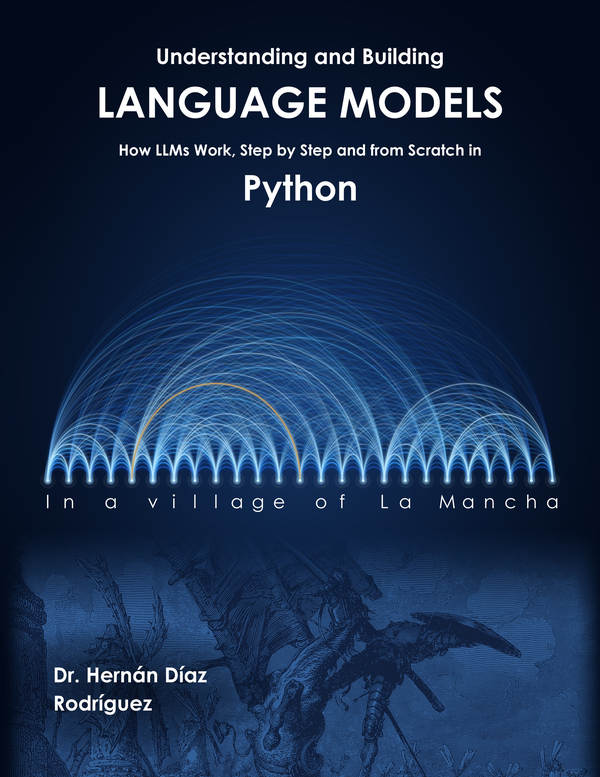

<!-- Header in HTML: GitHub Pages does not render Markdown inside a <div>; this way it looks the same on both sites. -->
<div align="center">
  <h1>Understanding and Building Language Models 📘</h1>
  <h3><em>How LLMs Work, Step by Step and from Scratch in Python</em></h3>
  <p></p>
  <p>by <strong>Hernán Díaz Rodríguez, PhD</strong> — Professor at the University of Oviedo · Former CERN researcher</p>
  <p>
    <a href="https://github.com/HernanDiaz/language-models"></a>
    <a href="https://creativecommons.org/licenses/by-nc/4.0/"></a>
    <a href="https://www.linkedin.com/in/hernandiazrodriguez"></a>
  </p>
</div>

---

## 📘 About this book

**Understanding and Building Language Models** explains how a language model works inside, like the ones behind today's conversational assistants, by building a small one from the ground up. It starts by fitting a straight line to the prices of a few houses and ends by training, fine-tuning, evaluating and documenting a small **GPT**: gradient descent, bigrams, neural networks, **tokenization with BPE**, **attention and the Transformer**, training with method, text generation, fine-tuning to follow instructions, evaluation and a capstone project.

All the models are deliberately small: **they train on the processor of an ordinary computer in a few minutes**, with no graphics card and no model downloads.

This folder contains the **11 interactive notebooks** of the English edition, one per chapter, ready to run in Google Colab.

> 📗 Part of the same series as [**Deep Learning with Python**](https://github.com/HernanDiaz/deep-learning/tree/main/en).
>
> 🇪🇸 ¿Prefieres la edición en español? Sus cuadernos están en la [raíz del repositorio](https://github.com/HernanDiaz/language-models).

---

## 📂 Folder structure

```
language-models/en/
├── 1_How_a_model_learns.ipynb           ← One notebook per chapter
├── 2_Language_modeling.ipynb
├── ...
├── 11_Capstone_project.ipynb
├── notebook/N/                          ← Links from the book to each notebook in Colab
└── video/N/                             ← Links from the book to each chapter's video
```

The data the notebooks use are in the repository's [`material/`](https://github.com/HernanDiaz/language-models/tree/main/material) folder.

---

## 🎯 What you will learn

The book and the notebooks are organized in **3 parts**:

| Part | Topic | Chapters |
|------|-------|----------|
| **1. Foundations** | Gradient descent, language models from counts, from a table to a network, networks with embeddings | 1–4 |
| **2. Building a GPT** | Tokenization with BPE, attention and the Transformer, training with method, generation and inference | 5–8 |
| **3. Fine-Tuning, Evaluating and Applying** | From base model to assistant, evaluation and limits, capstone project | 9–11 |

---

## 🚀 How to use the notebooks

- Click **Open in Colab** to run the code of each chapter, with nothing to install.
- Follow the book while you experiment with the examples: the notebook is the lab and the book is the explanation.
- Click **Video** to watch the chapter's summary on YouTube. They are all in the [book's playlist](https://www.youtube.com/playlist?list=PLV713YB9zc-0).
- Notebooks 1, 2, 3 and 5 use only standard Python; the others use **PyTorch**, which Colab already has installed. None needs a GPU.
- Notebooks 7, 9 and 11 train models for several minutes.
- If you prefer to run them locally, notebooks 5 to 10 download the data from the `material/` folder by themselves when they do not find it.

---

## 📚 Notebooks and videos

| Ch. | Title | Colab | Video |
|-----|-------|-------|-------|
| 1 | How a Model Learns | [](https://colab.research.google.com/github/HernanDiaz/language-models/blob/main/en/1_How_a_model_learns.ipynb) | [](https://youtu.be/UG8T1x5UlCQ) |
| 2 | Language Modeling | [](https://colab.research.google.com/github/HernanDiaz/language-models/blob/main/en/2_Language_modeling.ipynb) | [](https://youtu.be/OEP77UrWbr4) |
| 3 | From Counting to a Network | [](https://colab.research.google.com/github/HernanDiaz/language-models/blob/main/en/3_From_counting_to_a_network.ipynb) | [](https://youtu.be/pVxo_dkWsz8) |
| 4 | Networks to Predict Text | [](https://colab.research.google.com/github/HernanDiaz/language-models/blob/main/en/4_Networks_to_predict_text.ipynb) | [](https://youtu.be/Z9soR8tk868) |
| 5 | Tokenization | [](https://colab.research.google.com/github/HernanDiaz/language-models/blob/main/en/5_Tokenization.ipynb) | [](https://youtu.be/Ok-cNo_vsZ4) |
| 6 | Attention and the Transformer | [](https://colab.research.google.com/github/HernanDiaz/language-models/blob/main/en/6_Attention_and_the_Transformer.ipynb) | [](https://youtu.be/R8i-C2m-XKw) |
| 7 | Training and Data | [](https://colab.research.google.com/github/HernanDiaz/language-models/blob/main/en/7_Training_and_data.ipynb) | [](https://youtu.be/5Z0BMzlSAqA) |
| 8 | Generation and Inference | [](https://colab.research.google.com/github/HernanDiaz/language-models/blob/main/en/8_Generation_and_inference.ipynb) | [](https://youtu.be/nEHApegM0j4) |
| 9 | From Base Model to Assistant | [](https://colab.research.google.com/github/HernanDiaz/language-models/blob/main/en/9_From_base_model_to_assistant.ipynb) | [](https://youtu.be/A9vVSFgoMQ8) |
| 10 | Evaluation and Limits | [](https://colab.research.google.com/github/HernanDiaz/language-models/blob/main/en/10_Evaluation_and_limits.ipynb) | [](https://youtu.be/LyxtnogMJ7k) |
| 11 | Capstone Project | [](https://colab.research.google.com/github/HernanDiaz/language-models/blob/main/en/11_Capstone_project.ipynb) | [](https://youtu.be/USH0xNjO1h0) |

---

## 🗂️ Data

| File | Contents | Notebooks |
|------|----------|-----------|
| `material/quixote.txt` | Full text of *Don Quixote*, in John Ormsby's translation, in the public domain (Project Gutenberg) | 6 to 10 |
| `material/gpt_quixote.pt` | The character-level GPT trained in chapter 7 | 8 to 10 |
| `material/corpus_chapters_1_4.txt` | Text of chapters 1 to 4 of the book, to train the tokenizer | 5 and 10 |

---

## 👨‍🏫 About the author

**Hernán Díaz Rodríguez** is a Professor in the Department of Computer Science and Artificial Intelligence at the **University of Oviedo**, Spain, with a PhD in Computer Science from the same university. A graduate in Computer Engineering from the same institution, the author also holds an **MBA from the Open University (United Kingdom)**.

With more than 20 years of experience across the public and private sectors, Hernán Díaz has worked on advanced technology and research projects, including **5 years at CERN**, the European Organization for Nuclear Research — one of the world's largest scientific laboratories.

[💼 LinkedIn](https://www.linkedin.com/in/hernandiazrodriguez) · [📧 Email](mailto:hernan.diaz.rodriguez@gmail.com) · [📕 Amazon author page](https://www.amazon.es/Hernan-Diaz-Rodriguez/e/B0GD8JQ9JB)

---

## ⭐ Found this useful?

If these notebooks are helping you understand language models, you can support the project:

- ⭐ **Starring this repository** — it helps others discover the material.
- 💬 **Sharing it** with a colleague, student or teacher who could benefit.

Thank you! 🙏

---

## 📜 License

This material is distributed under [**Creative Commons Attribution-NonCommercial 4.0 International (CC BY-NC 4.0)**](https://creativecommons.org/licenses/by-nc/4.0/).

✅ **Allowed:** teaching, studying, personal notes; adaptations for educational purposes, **citing the author**.
❌ **Not allowed:** commercial or for-profit use; redistribution in commercial products without permission.

---

## 📖 How to cite

If you use this material in academic work, please cite:

```bibtex
@book{diazrodriguez2026languagemodels,
  author    = {Hern{\'a}n D{\'\i}az Rodr{\'\i}guez},
  title     = {Understanding and Building Language Models: How LLMs Work, Step by Step and from Scratch in Python},
  year      = {2026},
  publisher = {Independently published},
  url       = {https://github.com/HernanDiaz/language-models}
}
```

---

## ✉️ Contact

Found an error or have a suggestion? I'd love to hear from you:
📧 **hernan.diaz.rodriguez@gmail.com**

For institutional adoption of the book in courses or programs, please mention your institution and course in the email — I'm happy to support educators.
